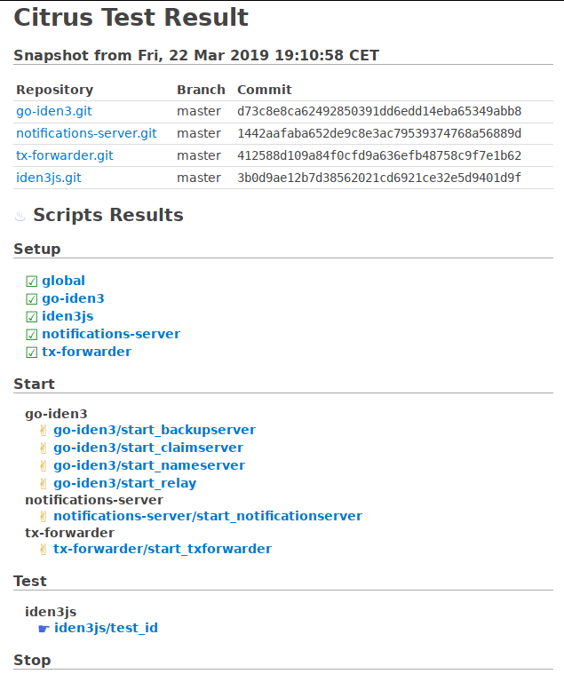

# Citrus

Citrus: Continuous Integration Testing running until sunrise.

Citrus is a simple continuous integration testing framework that can be
configured with scripts.

The basis of citrus is **running 4 steps for each batch**:

- Setup
- Start
- Test
- Stop

Each phase will execute the corresponding scripts, which can be defined
globally and per repository.

## Configuration

Each script will run through a prelude script that allows you to specify global
variables that will be available for all the scripts.

There can be one `setup` and `stop` script globally and per repository.  There
can be any number of `start` and `test` scripts per repository (their file name
must start with either `start` or `test`).

All the scripts must be executable (`chmod +x script`).

All the scripts will go to the configuration folder, where the top level
contains global scripts, and each folder with a repository names contains the
scripts that will run for that repository.

The configuration folder also contains a configuration file (`config.toml`)
where you specify the list of repository urls, and further parameters like
timeouts in seconds.

See the `example` folder for a specific example.

## Screenshots

## Other

The css style used in the web backend is based on the [the μ css
framework](https://bafs.github.io/mu/).

## License

GPLv3, see `LICENSE.txt`
