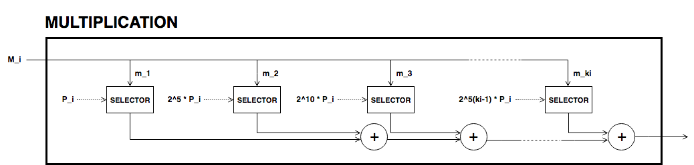
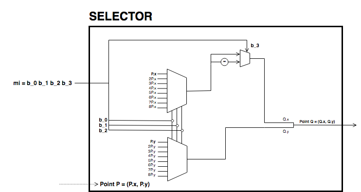

In pedersen hash, we have depicted the circuit used to compute (equatio
[eq-ped]). Each multiplication box returns one term of the sum.

|image| |image|

As the set of generators are fixed, we can precompute its multiples and
use 4-bit lookup windows to select the right points. This is done as
shown in next circuit selector.

|image|

The circuit receives as input a 4-bit chunk. The first three bits are
used to select the right multiple of the point and last bit decides the
sign of the point. Recall that negation on a point of a twisted Edwards
curve corresponds to negation of its first coordinate.

.. |image| image:: Diag/Ped_Hash.png

