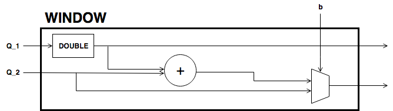
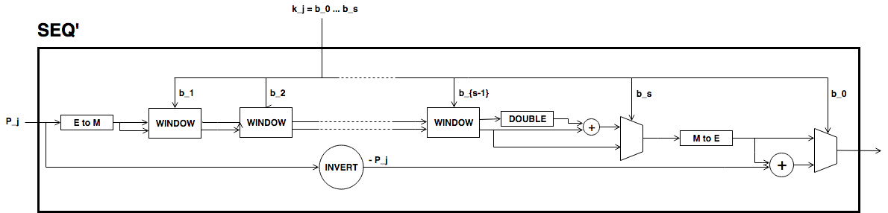

| We have seen we use a windowed scalar multiplication algorithm with
  signed digits. Each 4-bit message chunk corresponds to a window called
  selector and each chunk is encoded as an integer from the set
  :math:`\{-8..8\}\backslash \{0\}`. This allows a more efficient lookup
  of the window entry for each chunk than if the set :math:`\{1..16\}`
  had been used, because a point can be conditionally negated using only
  a single constraint :raw-latex:`\cite{sapling}`.
| As we have up to 50 segments per each generator :math:`P_i`, the
  largest multiple of the generator :math:`P_i` is :math:`n\cdot P_i`
  with

  .. math:: n = 2^0 \times8 + 2^5 \times 8 + \left(2^5\right)^2 \times8 \dots +   2^{245}\times 8 .

   We have to make sure that this number is smaller than
  :math:`(r-1)/2`, where :math:`r` is the order of the large prime
  subgroup of the curve. Indeed,

  .. math::

     \begin{aligned}
         \quad\; n 
         & = 8 \times \sum_{ k = 0}^{49} 2^{5k}
         = 8 \times \frac{2^{250}-1}{2^5-1}\\
         & = 466903585634339497675689455680193176827701551071131306610716064548036813064%\\\end{aligned}

   and

  .. math::

     \begin{aligned}
         \frac{r-1}{2} &= 1368015179489954701390400359078579693038406986079283629600107830474223686520 \\
         & > n.\\ \vspace{0.4cm}\end{aligned}

We define the twisted Edwards curve Baby-Jubjub defined over :math:`\Fp`
with

.. math::

   p = 21888242871839275222246405745257275088548364
               400416034343698204186575808495617

 described by

.. math:: E: 168700 x^2 + y^2 = 1 + 168696 x^2 y^2.

The order of :math:`E` is :math:`8\times r`, where

.. math::

   r = 2736030358979909402780800718157159386076813
               972158567259200215660948447373041.

 The rest of specifications and the satisfiability of SafeCurves
criteria of this curve can be found in :raw-latex:`\cite{github-barry}`.

1.2

.. raw:: latex

   \maketitle

.. raw:: latex

   \vspace{1cm}

.. raw:: latex

   \tableofcontents

.. raw:: latex

   \vspace{0.5cm}

.. raw:: latex

   \newpage

Elliptic curve: Baby-Jubjub
===========================

Twisted Edwards form
--------------------

Montgomery form
---------------

Arithmetic on the elliptic curve
================================

Addition of points
------------------

Multiplication by a scalar
--------------------------

Pedersen hash
=============

[sec-ped]

Set of generators
-----------------

Computation
-----------

There is no overflow
--------------------

Number of constraints per bit
-----------------------------

.. raw:: latex

   \newpage

.. raw:: latex

   \addcontentsline{toc}{section}{References}

.. raw:: latex

   \bibliographystyle{acm}

Let :math:`P\not= O` be a point of the twisted Edwards curve :math:`E`
of order strictly greater than 8 and let :math:`k` a binary number
representing an element of :math:`\Fp`. We describe the circuit used to
compute the point :math:`k\cdot P`.

#. First, we divide :math:`k` into chunks of 248 bits. If :math:`k` is
   not a multiple of 248, we take :math:`j` segments of 248 bits and
   leave a last chunk with the remaining bits. More precisly, write

   .. math::

      \begin{gathered}
              k = k_0 k_1 \dots k_j   \quad\text{with}\quad 
                  \begin{cases}
                  k_i = b^i_0 b^i_1 \dots b^i_{247}   \;\text{ for }  i = 0, \dots, j-1, \\
                  k_j = b^j_0 b^j_1 \dots b^j_s   \;\text{ with } s\leq 247.
                  \end{cases}
              \end{gathered}

    Then,

   .. math::

      \label{kP}
                  k\cdot P = k_0\cdot P + k_1\cdot 2^{248}P +\dots+ k_j\cdot 2^{248j}P.

    This sum is done using the following circuit. The terms of the sum
   are calculated separately inside the seq boxes and then added
   together.

   .. raw:: latex

      \centering

   |image|

#. Each seq box takes a point of :math:`E` of the from
   :math:`P_i = 2^{248 i} P` for :math:`i=0,\dots,j-1` and outputs two
   points

   .. math::

      2^{248} \cdot P_i 
                  \quad \text{and} \quad
                  \sum_{n = 0}^{247} b_n \cdot 2^{n} \cdot P_i.

    The first point is the input of the next :math:`(i+1)`-th seq box
   (note that :math:`2^{248} \cdot P_i = P_{i+1}`) whereas the second
   output is the computation of the :math:`i`-th term in expression
   (`[kP] <#kP>`__). The precise circuit is depicted in next two figures
   seq and window.

   .. raw:: latex

      \centering

   | |image|

   |image|

   The idea of the circuit is to first compute some point

   .. math::

      Q = P_i + b_1 \cdot (2P_i) + b_2 \cdot (4P_i) 
                      + b_3 \cdot (8P_i) + \dots + b_{247} \cdot (2^{247}P_i),

    and output the point

   .. math:: Q - b_0 \cdot P_i.

    This permits the computation of :math:`Q` using the Montgomery form
   of Baby-Jubjub and only use twisted Edwards for the second
   calculation. The reason to change forms is that, in the calculation
   of the output, we may get a sum with input the point at infinity if
   :math:`b_0 = 0`.

   Still, we have to ensure that none of the points being doubled or
   added when working in :math:`E_M` is the point at infinity and that
   we never add the same two points.

   -  By assumption, :math:`P\not= O` and ord\ :math:`(P)>8`. Hence, by
      Lagrange theorem :raw-latex:`\cite[Corollary 4.12]{lagrange}`,
      :math:`P` must have order :math:`r`, :math:`2r`, :math:`4r` or
      :math:`8r`. For this reason, none of the points in :math:`E_M`
      being doubled or added in the circuit is the point at infinity,
      because for any integer :math:`m`, :math:`2^m` is never a multiple
      of :math:`r`, even when :math:`2^m` is larger than :math:`r`, as
      :math:`r` is a prime number. Hence, :math:`2^m \cdot P \not= O`
      for any :math:`m\in\Z`.

   -  Looking closely at the two inputs of the sum, it is easy to
      realize that they have different parity, one is an even multiple
      of :math:`P_i` and the other an odd multiple of :math:`P_i`, so
      they must be different points. Hence, the sum in :math:`E_M` is
      done correctly.

#. The last term of expression (`[kP] <#kP>`__) is computed in a very
   similar manner. The difference is that the number of bits composing
   :math:`k_j` may be shorter and that there is no need to compute
   :math:`P_{j+1}`, as there is no other seq box after this one. So,
   there is only output, the point
   :math:`k_j \cdot P_j = k_j\cdot 2^{248j} P`. This circuit is named
   seq’.

   .. raw:: latex

      \centering

   |image|

| Baby-Jubjub is birationally equivalent to the Montgomery elliptic
  curve defined by

  .. math:: E_M : v^2 = u^3 + 168698 u^2 + u.

   The birational equivalence from :math:`E` to :math:`E_M` is the map

  .. math:: (x,y) \to (u,v) = \left( \frac{1 + y}{1 - y} , \frac{1 + y}{(1 - y)x} \right)

   with inverse from :math:`E_M` to :math:`E`

  .. math:: (u, v) \to (x, y) = \left(  \frac{u}{v}, \frac{u - 1}{u + 1}   \right).

   These results are from :raw-latex:`\cite[Theorem 3.2]{twisted}`. Let
  :math:`p` be a prime number and :math:`\Fp` the finite field with
  :math:`p` elements. Let :math:`E` be an elliptic curve defined over
  :math:`\Fp` of order :math:`n = h\times r`, where :math:`r` is a large
  prime and :math:`h` is typically a small positive integer called
  cofactor.

+-----------------------+-----------------------+-----------------------+
| Group                 | Description           | Order                 |
+=======================+=======================+=======================+
| :math:`\Fp`           | Finite field with     | :math:`p`             |
|                       | :math:`p` elements    |                       |
+-----------------------+-----------------------+-----------------------+
| :math:`E`             | Elliptic curve group  | :math:`n = h\times r` |
+-----------------------+-----------------------+-----------------------+
| :math:`\G \subseteq E | Subgroup of points of | :math:`r`             |
| `                     | :math:`E` of order    |                       |
|                       | :math:`r`             |                       |
+-----------------------+-----------------------+-----------------------+

| When using 3-bit and 4-bit windows, we have 1 constraint for the sign
  and 3 for the sum (as we are using the Montgomery form of the curve,
  that requires only 3). Now let’s look at the constraints required for
  the multiplexers.
| With 3-bit windows we need only one constraint per multiplexer, so 2
  constraints in total.
| Standard 4-bit windows require two constraints: one for the output and
  another to compute :math:`s_0*s_1`. So, a priori we would need 4
  constraints, two per multiplexer. But we can reduce it to 3 as the
  computation of :math:`s_0*s_1` is the same in both multiplexers, so
  this constraint can be reused. This way only 3 constraints are
  required.
| So, the amount of constraints per bit are:

-  3-lookup window : :math:`(1+3+2)/3 = 2` constraints per bit.

-  4-lookup window : :math:`(1 +3+3)/4 = 1.75` constraints per bit.

The specific constraints can be determined as follows: let the
multiplexers of coordinates :math:`x` and :math:`y` be represented by
the following look up tables:

.. raw:: latex

   \centering

+-------------+-------------+-------------+-------------+
| :math:`s_2` | :math:`s_1` | :math:`s_0` | :math:`out` |
+=============+=============+=============+=============+
| 0           | 0           | 0           | :math:`a_0` |
+-------------+-------------+-------------+-------------+
| 0           | 0           | 1           | :math:`a_1` |
+-------------+-------------+-------------+-------------+
| 0           | 1           | 0           | :math:`a_2` |
+-------------+-------------+-------------+-------------+
| 0           | 1           | 1           | :math:`a_3` |
+-------------+-------------+-------------+-------------+
| 1           | 0           | 0           | :math:`a_4` |
+-------------+-------------+-------------+-------------+
| 1           | 0           | 1           | :math:`a_5` |
+-------------+-------------+-------------+-------------+
| 1           | 1           | 0           | :math:`a_6` |
+-------------+-------------+-------------+-------------+
| 1           | 1           | 1           | :math:`a_7` |
+-------------+-------------+-------------+-------------+

.. raw:: latex

   \centering

+-------------+-------------+-------------+-------------+
| :math:`s_2` | :math:`s_1` | :math:`s_0` | :math:`out` |
+=============+=============+=============+=============+
| 0           | 0           | 0           | :math:`b_0` |
+-------------+-------------+-------------+-------------+
| 0           | 0           | 1           | :math:`b_1` |
+-------------+-------------+-------------+-------------+
| 0           | 1           | 0           | :math:`b_2` |
+-------------+-------------+-------------+-------------+
| 0           | 1           | 1           | :math:`b_3` |
+-------------+-------------+-------------+-------------+
| 1           | 0           | 0           | :math:`b_4` |
+-------------+-------------+-------------+-------------+
| 1           | 0           | 1           | :math:`b_5` |
+-------------+-------------+-------------+-------------+
| 1           | 1           | 0           | :math:`b_6` |
+-------------+-------------+-------------+-------------+
| 1           | 1           | 1           | :math:`b_7` |
+-------------+-------------+-------------+-------------+

We can express them with the following 3 constraints:

-  :math:`aux = s_0 s_1`

-  | :math:`out = [ (a_7-a_6-a_5+a_4-a_3+a_2+a_1-a_0)*aux 
                 + (a_6-a_4-a_2+a_0)*s_1`
   | :math:`\text{\qquad\;\;} + (a_5-a_4-a_1+a_0)*s_0
                 + (a_4 - a_0) ] z 
                 + (a_3-a_2-a_1+a_0)*aux + (a_2-a_0)*s_1 + (a_1-a_0)*s_0+ a_0`

-  | :math:`out = [ (b_7-b_6-b_5+b_4-b_3+b_2+b_1-b_0)*aux 
                 + (b_6-b_4-b_2+b_0)*s_1`
   | :math:`\text{\qquad\;\;} + (b_5-b_4-b_1+b_0)*s_0 
                 + (b_4 - b_0)] z 
                 + (b_3-b_2-b_1+b_0)*aux + (b_2-b_0)*s_1 + (b_1-b_0)*s_0+ b_0`

In pedersen hash, we have depicted the circuit used to compute (equatio
`[eq-ped] <#eq-ped>`__). Each multiplication box returns one term of the
sum.

.. raw:: latex

   \centering

|image| |image|

As the set of generators are fixed, we can precompute its multiples and
use 4-bit lookup windows to select the right points. This is done as
shown in next circuit selector.

.. raw:: latex

   \centering

|image|

The circuit receives as input a 4-bit chunk. The first three bits are
used to select the right multiple of the point and last bit decides the
sign of the point. Recall that negation on a point of a twisted Edwards
curve corresponds to negation of its first coordinate. Let :math:`M` be
a sequence of bits. We construct the Pedersen hash of :math:`M` as
follows:

-  Sample :math:`P_0,P_1,\dots,P_k` uniformly in :math:`\G` (for some
   specified integer :math:`k`).

-  Split :math:`M` into sequences of 4 bits [1]_. More precisely, write

   .. math::

      \begin{gathered}
              M = M_1M_2\dots M_l 
              \quad\text{where}\quad
              M_i = m_1m_2\dots m_{k_i}
              \quad\text{with}\quad 
              \begin{cases}
                  k_i = 50    \;\text{ for }  i = 0, \dots, l-1, \\
                  k_l \leq 50,
              \end{cases}
          \end{gathered}

    where the :math:`m_j` terms are 4-bit chunks
   :math:`[b_0^j\: b_1^j\: b_2^j\: b_3^j]`. Define

   .. math::

      enc(m_j) = (2b_3^j-1) 
              \cdot (1+b_{0}^j+2b_{1}^j+4b^j_{2})

    and let

   .. math:: \langle M_i \rangle = \sum_{j=1}^{k_i} enc(m_j) \cdot 2^{5(j-1)}.

    We define the Pedersen hash of :math:`M` as

   .. math::

      \label{eq-ped}
              H(M) = \langle M_0 \rangle \cdot P_0 
              +  \langle M_1 \rangle \cdot P_1 
              +  \langle M_2 \rangle \cdot P_2 
              + \dots + \langle M_l \rangle \cdot P_l.

    Note that the expression above is a linear combination of elements
   of :math:`\G`, so itself is also an element of :math:`\G`. That is,
   the resulting Pedersen hash :math:`H(M)` is a point of the elliptic
   curve :math:`E` of order :math:`r`.

The computation of the Pedersen hash has two steps: first, the base
points :math:`P_0, P_1, \dots, P_k` need to be generated. This only
needs to be done once, as they can be reused to compute hashes of other
data. And secondly, the calculation of expression
(`[eq-ped] <#eq-ped>`__). The circuits used to compute this sum are
quite similar to the ones used to calculate the multiple of a point of
an elliptic curve except that here we only work with the twisted Edwards
form of :math:`E` and we can have many points precalculated, so instead
of doubling all the time, we work with look-up tables. In this section
we define two operations supported in the elliptic curve group: addition
of points and multiplication of a point by a scalar (an element of
:math:`\Fp`).

We generate the points :math:`P_0,\dots,P_k` described in section
`[sec-ped] <#sec-ped>`__ in such a manner that it is difficult to find a
connection between any of these two points. More precisely, we take
``D = "Iden3\_PedersenGenerator\_"`` followed by a byte ``S`` holding
that smallest number that ``H = Blake2s-256(D || S)`` results in a point
in the elliptic curve. We use the specification of Blake2s-256 hash
function defined in https://tools.ietf.org/html/rfc7693#appendix-D.

When adding points of elliptic curves in Montgomery form, one has to be
careful if the points being added are equal (doubling) or not (adding)
and if one of the points is the point at infinity
:raw-latex:`\cite{montgomery}`. Twisted Edwards curves have the
advantage that there is no such case distinction and doubling can be
performed with exactly the same formula as addition
:raw-latex:`\cite{twisted}`. In comparison, operating in Montgomery
curves is cheaper. In this section, we summarize how addition and
doubling is performed in both forms. For the exact number of operations
required in different forms of elliptic curves, see
:raw-latex:`\cite{operations-cost}`.

-  : Let :math:`\point{1}` and :math:`\point{2}` be points of the
   Baby-Jubjub twisted Edwards elliptic curve :math:`E`. The sum
   :math:`P_1 + P_2` is a third point :math:`P_3 = (x_3, y_3)` with

   .. math::

      \begin{aligned}
                  &\lambda = 168696 x_1x_2y_1y_2,\\
                  &x_3 = (x_1y_2 + y_1x_2) / (1 + \lambda),\\
                  &y_3 = (y_1y_2 - 168700 x_1x_2) / (1 - \lambda).
              \end{aligned}

    Note that the neutral element is the point :math:`O = (0,1)` and the
   inverse of a point :math:`(x,y)` is :math:`(-x,y)`.

-  : Let :math:`\point{1}\not=O` and :math:`\point{2}\not=O` be two
   points of the Baby-JubJub elliptic curve :math:`E_M` in Montgomery
   form.

   If :math:`P_1\not=P_2`, then the sum :math:`P_1 + P_2` is a third
   point :math:`P_3 = (x_3, y_3)` with coordinates

   .. math::

      \begin{aligned}
              \label{eq-ted}
              \begin{split}
                  &\Lambda = (y_2-y_1)/ (x_2-x_1),\\
                  &x_3 = \Lambda^2 - 168698 - x_1 - x_2,\\
                  &y_3 = \Lambda(x_1- x_3) - y_1.
              \end{split}
              \end{aligned}

    If :math:`P_1 = P_2`, then :math:`2\cdot P_1` is a point
   :math:`P_3 = (x_3, y_3)` with coordinates

   .. math::

      \begin{aligned}
              \label{eq-mont}
              \begin{split}
                  &\Lambda = (3x_1^2 + 2Ax_1 + 1)/ (2By_1),\\
                  &x_3 = B\Lambda^2 - A - 2x_1,\\
                  &y_3 = \Lambda(x_1- x_3) - y_1.
              \end{split} 
              \end{aligned}

16 cm 22 cm -1 cm -0 cm

.. [1]
   If :math:`M` is not a multiple of 4, pad :math:`M` to a multiple of 4
   bits by appending zero bits.

.. |image| image:: Diag/Mult_by_scalar.png
.. |image| image:: Diag/Mult_by_scalar_SEQ.png

.. |image| image:: Diag/Ped_Hash.png
.. |image| image:: Diag/Ped_Hash_Multiplication.png
.. |image| image:: Diag/Ped_Hash_Multiplication_selector.png

