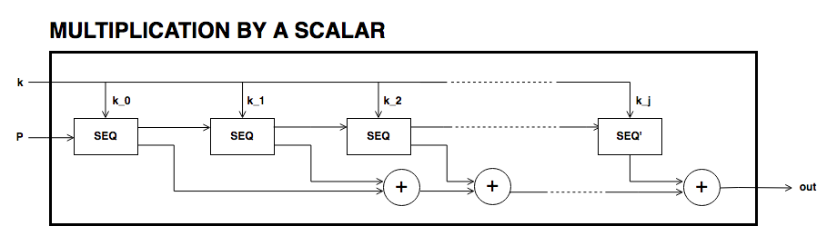
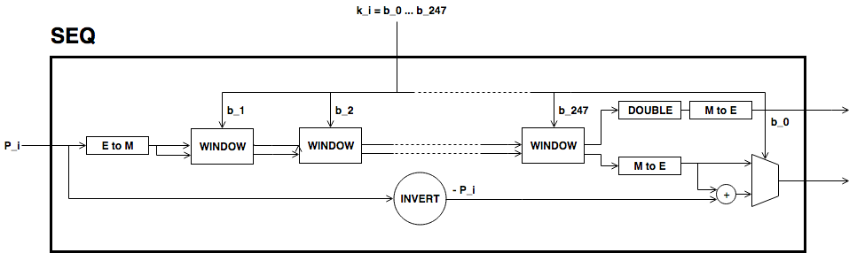

1.2

.. raw:: latex

   \maketitle 

.. raw:: latex

   \vspace{1.5cm}

.. raw:: latex

   \tableofcontents

.. raw:: latex

   \vspace{0.5cm}

.. raw:: latex

   \newpage

Scope
=====

Motivation
==========

Background
==========

Terminology And Description
===========================

Generation Of Baby Jubjub
-------------------------

| In 2016, a group of researchers of IRPF designed a deterministic
  algorithm that, given a prime number :math:`p`, it returns the
  elliptic curve defined over :math:`\Fp` with smallest coefficient
  :math:`A` such that :math:`A-2` is a multiple of 4 and equation
  :math:`y^2 = x^3 + Ax^2 + x` describes a Montgomery curve. The
  assumption :math:`A-2` divisible by 4 comes from the fact that as this
  value is used in many operations, so trying to keep it smaller and
  divisible by four is a reasonable assumption
  :raw-latex:`\cite{generation-baby}`.
| SafeCurves is a project that checks some of the most common and known
  attacks on several elliptic curves. It also provides the algorithm it
  was used :raw-latex:`\cite{safe-curves}`.
| We considered the large prime number dividing the order of BN128 and
  run algorithm A.1 from :raw-latex:`\cite{generation-baby}`. The first
  elliptic curve it was returned satisfying SafeCurves criteria was the
  Montgomery curve with coefficient :math:`A = 168698`. We named this
  curve Baby Jubjub elliptic curve.

Definition Of Baby Jubjub
-------------------------

From now on, let

.. math::

   p = 21888242871839275222246405745257275088548364
                   400416034343698204186575808495617

 and :math:`\Fp` the finite field with :math:`p` elements.

Montgomery Form
~~~~~~~~~~~~~~~

We define :math:`E_M` as the Baby-Jubjub Montgomery elliptic curve
defined over :math:`\Fp` given by equation

.. math:: E: v^2 = u^3 +  168698u^2 + u.

 The order of :math:`E_M` is :math:`n = 8\times r`, where

.. math::

   r = 2736030358979909402780800718157159386076813972
           158567259200215660948447373041

 is a prime number. Denote by :math:`\G` the subgroup of points of order
:math:`r`, that is,

.. math:: \G = \Set{ P \in E(\Fp) | r P = O  }.

Edwards Form
~~~~~~~~~~~~

| :math:`E_M` is birationally equivalent to the Edwards elliptic curve

  .. math:: E: x^2 + y^2 = 1 +  d x^2 y^2

   where
  :math:`d = 9706598848417545097372247223557719406784115219466060233080913168975159366771.`
| The birational equivalence :raw-latex:`\cite[Thm. 3.2]{twisted}` from
  :math:`E` to :math:`E_M` is the map

  .. math:: (x,y) \to (u,v) = \left( \frac{1 + y}{1 - y} , \frac{1 + y}{(1 - y)x} \right)

   with inverse from :math:`E_M` to :math:`E`

  .. math:: (u, v) \to (x, y) = \left(  \frac{u}{v}, \frac{u - 1}{u + 1}   \right).

Arithmetic In Baby Jubjub
-------------------------

In this section we define how to operate in the elliptic curve group:
the addition of points and multiplication of a point by a scalar (an
element of :math:`\Fp`).

Addition Of Points
~~~~~~~~~~~~~~~~~~

Multiplication Of A Point Of :math:`E` By A Scalar
~~~~~~~~~~~~~~~~~~~~~~~~~~~~~~~~~~~~~~~~~~~~~~~~~~

Challenges And Security
=======================

As required in the construction of Baby-Jubjub, the curve satisfies
SafeCurves criteria. This can be checked following
:raw-latex:`\cite{github-barry}`.

Implementation
==============

Barry WhiteHat:

-  https://github.com/barryWhiteHat/baby_jubjub

-  https://github.com/barryWhiteHat/baby_jubjub_ecc

Jordi Baylina:
https://github.com/iden3/circomlib/blob/master/src/babyjub.js

Intellectual Property
=====================

.. raw:: latex

   \addcontentsline{toc}{section}{References}

.. raw:: latex

   \bibliographystyle{acm}

When adding points of elliptic curves in Montgomery form, one has to be
careful if the points being added are equal (doubling) or not (adding)
and if one of the points is the point at infinity
:raw-latex:`\cite{montgomery}`. Edwards curves have the advantage that
there is no such case distinction and doubling can be performed with
exactly the same formula as addition :raw-latex:`\cite{twisted}`. In
comparison, operating in Montgomery curves is cheaper. In this section,
we summarize how addition and doubling is performed in both forms. For
the exact number of operations required in different forms of elliptic
curves, see :raw-latex:`\cite{twisted}`.

-  : Let :math:`\point{1}` and :math:`\point{2}` be points of the
   Baby-Jubjub twisted Edwards elliptic curve :math:`E`. The sum
   :math:`P_1 + P_2` is a third point :math:`P_3 = (x_3, y_3)` with

   .. math::

      \begin{aligned}
                  &\lambda = d x_1x_2y_1y_2,\\
                  &x_3 = (x_1y_2 + y_1x_2) / (1 + \lambda),\\
                  &y_3 = (y_1y_2 - x_1x_2) / (1 - \lambda).
              \end{aligned}

    Note that the neutral element is the point :math:`O = (0,1)` and the
   inverse of a point :math:`(x,y)` is :math:`(-x,y)`.

-  : Let :math:`\point{1}\not=O` and :math:`\point{2}\not=O` be two
   points of the Baby-JubJub elliptic curve :math:`E_M` in Montgomery
   form.

   If :math:`P_1\not=P_2`, then the sum :math:`P_1 + P_2` is a third
   point :math:`P_3 = (x_3, y_3)` with coordinates

   .. math::

      \begin{aligned}
              \label{eq-ted}
              \begin{split}
                  &\Lambda = (y_2-y_1)/ (x_2-x_1),\\
                  &x_3 = \Lambda^2 - A - x_1 - x_2,\\
                  &y_3 = \Lambda(x_1- x_3) - y_1.
              \end{split}
              \end{aligned}

    If :math:`P_1 = P_2`, then :math:`2\cdot P_1` is a point
   :math:`P_3 = (x_3, y_3)` with coordinates

   .. math::

      \begin{aligned}
              \label{eq-mont}
              \begin{split}
                  &\Lambda = (3x_1^2 + 2Ax_1 + 1)/ (2y_1),\\
                  &x_3 = \Lambda^2 - A - 2x_1,\\
                  &y_3 = \Lambda(x_1- x_3) - y_1.
              \end{split} 
              \end{aligned}

.. raw:: latex

   \usetikzlibrary{arrows}

.. raw:: latex

   \usetikzlibrary{positioning}

.. raw:: latex

   \DeclarePairedDelimiter{\floor}{\lfloor}{\rfloor}

.. raw:: latex

   \makeatletter

.. raw:: latex

   \makeatother

[]Python morekeywords=False,sage,True,sensitive=true

16 cm 22.5 cm -1 cm -0 cm

.. raw:: latex

   \tikzset{%
       leaf/.style = {draw, fill}, %, minimum size=\minSize},
       empty/.style = {draw},
       wrong/.style = {draw, fill = red},
       internal/.style = {draw, path picture={\draw 
               (path picture bounding box.south east) -- (path picture bounding box.north west)        (path picture bounding box.south west) -- (path picture bounding box.north east);}}
   }

This proposal aims to define a specific elliptic curve defined over the
large prime subgroup of BN128 elliptic curve.

We will release the final version of this proposal under creative
commons, to ensure it is freely available to everyone.

Let :math:`P\not= O` be a point of the Edwards curve :math:`E` of order
strictly greater than 8 (i.e. :math:`P\in\ensuremath{\mathbb{G}}`) and
let :math:`k` a binary number representing an element of
:math:`\ensuremath{\mathbb{F}_p}`. We describe the circuit used to
compute the point :math:`k\cdot P`.

#. First, we divide :math:`k` into chunks of 248 bits. If :math:`k` is
   not a multiple of 248, we take :math:`j` segments of 248 bits and
   leave a last chunk with the remaining bits. More precisly, write

   .. math::

      \begin{gathered}
              k = k_0 k_1 \dots k_j   \quad\text{with}\quad 
                  \begin{cases}
                  k_i = b^i_0 b^i_1 \dots b^i_{247}   \;\text{ for }  i = 0, \dots, j-1, \\
                  k_j = b^j_0 b^j_1 \dots b^j_s   \;\text{ with } s\leq 247.
                  \end{cases}
              \end{gathered}

    Then,

   .. math::

      \label{kP}
                  k\cdot P = k_0\cdot P + k_1\cdot 2^{248}P +\dots+ k_j\cdot 2^{248j}P.

    This sum is done using the following circuit. The terms of the sum
   are calculated separately inside the seq boxes and then added
   together.

   .. raw:: latex

      \centering

   |image|

#. Each seq box takes a point of :math:`E` of the from
   :math:`P_i = 2^{248 i} P` for :math:`i=0,\dots,j-1` and outputs two
   points

   .. math::

      2^{248} \cdot P_i 
                  \quad \text{and} \quad
                  \sum_{n = 0}^{247} b_n \cdot 2^{n} \cdot P_i.

    The first point is the input of the next :math:`(i+1)`-th seq box
   (note that :math:`2^{248} \cdot P_i = P_{i+1}`) whereas the second
   output is the computation of the :math:`i`-th term in expression
   (`[kP] <#kP>`__). The precise circuit is depicted in next two figures
   seq and window.

   .. raw:: latex

      \centering

   | |image|

   |image|

   The idea of the circuit is to first compute

   .. math::

      Q = P_i + b_1 \cdot (2P_i) + b_2 \cdot (4P_i) 
                      + b_3 \cdot (8P_i) + \dots + b_{247} \cdot (2^{247}P_i),

    and output the point

   .. math:: Q - b_0 \cdot P_i.

    This permits the computation of :math:`Q` using the Montgomery form
   of Baby-Jubjub and only use twisted Edwards for the second
   calculation. The reason to change forms is that, in the calculation
   of the output, we may get a sum with input the point at infinity if
   :math:`b_0 = 0`.

   Still, we have to ensure that none of the points being doubled or
   added when working in :math:`E_M` is the point at infinity and that
   we never add the same two points.

   -  By assumption, :math:`P\not= O` and ord\ :math:`(P)>8`. Hence, by
      Lagrange theorem :raw-latex:`\cite[Corollary 4.12]{lagrange}`,
      :math:`P` must have order :math:`r`, :math:`2r`, :math:`4r` or
      :math:`8r`. For this reason, none of the points in :math:`E_M`
      being doubled or added in the circuit is the point at infinity,
      because for any integer :math:`m`, :math:`2^m` is never a multiple
      of :math:`r`, even when :math:`2^m` is larger than :math:`r`, as
      :math:`r` is a prime number. Hence, :math:`2^m \cdot P \not= O`
      for any :math:`m\in\ensuremath{\mathbb{Z}}`.

   -  Looking closely at the two inputs of the sum, it is easy to
      realize that they have different parity, one is an even multiple
      of :math:`P_i` and the other an odd multiple of :math:`P_i`, so
      they must be different points. Hence, the sum in :math:`E_M` is
      done correctly.

#. The last term of expression (`[kP] <#kP>`__) is computed in a very
   similar manner. The difference is that the number of bits composing
   :math:`k_j` may be shorter and that there is no need to compute
   :math:`P_{j+1}`, as there is no other seq box after this one. So,
   there is only output, the point
   :math:`k_j \cdot P_j = k_j\cdot 2^{248j} P`. This circuit is named
   seq’.

   .. raw:: latex

      \centering

   |image|

The search for this elliptic curve defined is motivated by its
usefulness in zk-SNARK proofs. Moreover the ability to find it in a
deterministic way—so that it was clear no other considerations were
taken for defining—is paramount as it significantly reduces the
possibility of a backdoor being present, thus leading to better
security.

With this purpose, we used a deterministic algorithm for finding
elliptic curves over a specified finite field
:raw-latex:`\cite{generation-baby}` together with the restrictions of
security parameters described in SafeCurves project
:raw-latex:`\cite{safe-curves}`.

We define the twisted Edwards curve Baby-Jubjub defined over
:math:`\ensuremath{\mathbb{F}_p}` with

.. math::

   p = 21888242871839275222246405745257275088548364
               400416034343698204186575808495617

 described by

.. math:: E: 168700 x^2 + y^2 = 1 + 168696 x^2 y^2.

The order of :math:`E` is :math:`8\times r`, where

.. math::

   r = 2736030358979909402780800718157159386076813
               972158567259200215660948447373041.

 The rest of specifications and the satisfiability of SafeCurves
criteria of this curve can be found in :raw-latex:`\cite{github-barry}`.

.. |image| image:: figures/multiplication-SEQ-window.png
.. |image| image:: figures/multiplication-SEQ-prime.png

