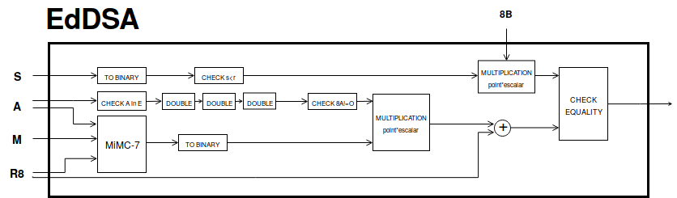

= [draw, minimum size=2em] = [pin edge=to-,thin,black]

When adding points of elliptic curves in Montgomery form, one has to be
careful if the points being added are equal (doubling) or not (adding)
and if one of the points is the point at infinity
:raw-latex:`\cite{montgomery}`. Edwards curves have the advantage that
there is no such case distinction and doubling can be performed with
exactly the same formula as addition :raw-latex:`\cite{twisted}`. In
comparison, operating in Montgomery curves is cheaper. In this section,
we summarize how addition and doubling is performed in both forms. For
the exact number of operations required in different forms of elliptic
curves, see :raw-latex:`\cite{twisted}`.

-  : Let :math:`\point{1}` and :math:`\point{2}` be points of the
   Baby-Jubjub twisted Edwards elliptic curve :math:`E`. The sum
   :math:`P_1 + P_2` is a third point :math:`P_3 = (x_3, y_3)` with

   .. math::

      \begin{aligned}
                  &\lambda = d x_1x_2y_1y_2,\\
                  &x_3 = (x_1y_2 + y_1x_2) / (1 + \lambda),\\
                  &y_3 = (y_1y_2 - x_1x_2) / (1 - \lambda).
              \end{aligned}

    Note that the neutral element is the point :math:`O = (0,1)` and the
   inverse of a point :math:`(x,y)` is :math:`(-x,y)`.

-  : Let :math:`\point{1}\not=O` and :math:`\point{2}\not=O` be two
   points of the Baby-JubJub elliptic curve :math:`E_M` in Montgomery
   form.

   If :math:`P_1\not=P_2`, then the sum :math:`P_1 + P_2` is a third
   point :math:`P_3 = (x_3, y_3)` with coordinates

   .. math::

      \begin{aligned}
              \label{eq-ted}
              \begin{split}
                  &\Lambda = (y_2-y_1)/ (x_2-x_1),\\
                  &x_3 = \Lambda^2 - A - x_1 - x_2,\\
                  &y_3 = \Lambda(x_1- x_3) - y_1.
              \end{split}
              \end{aligned}

    If :math:`P_1 = P_2`, then :math:`2\cdot P_1` is a point
   :math:`P_3 = (x_3, y_3)` with coordinates

   .. math::

      \begin{aligned}
              \label{eq-mont}
              \begin{split}
                  &\Lambda = (3x_1^2 + 2Ax_1 + 1)/ (2y_1),\\
                  &x_3 = \Lambda^2 - A - 2x_1,\\
                  &y_3 = \Lambda(x_1- x_3) - y_1.
              \end{split} 
              \end{aligned}

.. raw:: latex

   \usetikzlibrary{arrows}

.. raw:: latex

   \usetikzlibrary{positioning}

.. raw:: latex

   \DeclarePairedDelimiter{\floor}{\lfloor}{\rfloor}

.. raw:: latex

   \makeatletter

.. raw:: latex

   \makeatother

16 cm 20 cm -1 cm -0 cm

.. raw:: latex

   \tikzset{%
       leaf/.style = {draw, fill}, %, minimum size=\minSize},
       empty/.style = {draw},
       wrong/.style = {draw, fill = red},
       internal/.style = {draw, path picture={\draw 
               (path picture bounding box.south east) -- (path picture bounding box.north west)        (path picture bounding box.south west) -- (path picture bounding box.north east);}}
   }

| The hash function used in EdDSA is MiMC-7 based in paper
  :raw-latex:`\cite{mimc}`, which describes the hash using exponent 3.
  In this specification, we use exponent 7 (hence the name MiMC-7) as 3
  and :math:`l-1` are not coprime and 7 is the optimal choice for
  exponentiation :raw-latex:`\cite[Sec. 6]{mimc}`.
| Let :math:`\ensuremath{\mathbb{F}_l}` be the finite field with
  :math:`l` elements. The block cipher is constructed by iterating a
  round function :math:`r` times where each round consists of a key
  addition with the key :math:`k`, the addition of a round constant
  :math:`c_i\in \ensuremath{\mathbb{F}_r}`, and the application of a
  non-linear function defined as :math:`F(x) :=x^7` for
  :math:`x\in \ensuremath{\mathbb{F}_l}`. The ciphertext is finally
  produced by adding the key :math:`k` again to the output of the last
  round. Hence, the round function is described as
  :math:`F_i(x) = F(x) \oplus k \oplus c_i` where :math:`c_0 = c_r = 0`
  and the encryption process is defined as

  .. math:: E_k(x) = (F_{r-1} \circ F_{r-2} \circ ... \circ F_0)(x) \oplus k.

As the random constants :math:`c_i` do not need to be generated for
every evaluation of MiMC-7, they are hard-coded into the implementation.
The generation of these constants and the required number of rounds is
described in section `6.2 <#sec-mimc>`__.

| Consider the prime number

  .. math::

     p = 21888242871839275222246405745257275088548364
     400416034343698204186575808495617

   and let :math:`\ensuremath{\mathbb{F}_p}` be the finite field with
  :math:`p` elements. We define :math:`E_M` as the Baby-Jubjub
  Montgomery elliptic curve defined over
  :math:`\ensuremath{\mathbb{F}_p}` given by equation

  .. math:: E: v^2 = u^3 +  168698u^2 + u.

   The order of :math:`E_M` is :math:`n = 8\times l`, where

  .. math::

     l = 2736030358979909402780800718157159386076813972
     158567259200215660948447373041

   is a prime number. Denote by :math:`\ensuremath{\mathbb{G}}` the
  subgroup of points of order :math:`l`, that is,

  .. math:: \ensuremath{\mathbb{G}}= \Set{ P \in E(\ensuremath{\mathbb{F}_p}) | l P = O  }.

   Let

  .. math::

     \begin{aligned}
         B =  (17777552123799933955779906779655732241715742912184938656739573121738514868268,\\
     2626589144620713026669568689430873010625803728049924121243784502389097019475)\end{aligned}

   be a generator of :math:`\ensuremath{\mathbb{G}}`.
| :math:`E_M` is birationally equivalent to the Edwards elliptic curve

  .. math:: E: x^2 + y^2 = 1 +  d x^2 y^2

   where
  :math:`d = 9706598848417545097372247223557719406784115219466060233080913168975159366771.`
| The birational equivalence :raw-latex:`\cite[Thm. 3.2]{twisted}` from
  :math:`E` to :math:`E_M` is the map

  .. math:: (x,y) \to (u,v) = \left( \frac{1 + y}{1 - y} , \frac{1 + y}{(1 - y)x} \right)

   with inverse from :math:`E_M` to :math:`E`

  .. math:: (u, v) \to (x, y) = \left(  \frac{u}{v}, \frac{u - 1}{u + 1}   \right).

Let :math:`P\not= O` be a point of the Edwards curve :math:`E` of order
strictly greater than 8 (i.e. :math:`P\in\ensuremath{\mathbb{G}}`) and
let :math:`k` a binary number representing an element of
:math:`\ensuremath{\mathbb{F}_p}`. We describe the circuit used to
compute the point :math:`k\cdot P`.

#. First, we divide :math:`k` into chunks of 248 bits. If :math:`k` is
   not a multiple of 248, we take :math:`j` segments of 248 bits and
   leave a last chunk with the remaining bits. More precisly, write

   .. math::

      \begin{gathered}
              k = k_0 k_1 \dots k_j   \quad\text{with}\quad 
                  \begin{cases}
                  k_i = b^i_0 b^i_1 \dots b^i_{247}   \;\text{ for }  i = 0, \dots, j-1, \\
                  k_j = b^j_0 b^j_1 \dots b^j_s   \;\text{ with } s\leq 247.
                  \end{cases}
              \end{gathered}

    Then,

   .. math::

      \label{kP}
                  k\cdot P = k_0\cdot P + k_1\cdot 2^{248}P +\dots+ k_j\cdot 2^{248j}P.

    This sum is done using the following circuit. The terms of the sum
   are calculated separately inside the seq boxes and then added
   together.

   .. raw:: latex

      \centering

   |image|

#. Each seq box takes a point of :math:`E` of the from
   :math:`P_i = 2^{248 i} P` for :math:`i=0,\dots,j-1` and outputs two
   points

   .. math::

      2^{248} \cdot P_i 
                  \quad \text{and} \quad
                  \sum_{n = 0}^{247} b_n \cdot 2^{n} \cdot P_i.

    The first point is the input of the next :math:`(i+1)`-th seq box
   (note that :math:`2^{248} \cdot P_i = P_{i+1}`) whereas the second
   output is the computation of the :math:`i`-th term in expression
   (`[kP] <#kP>`__). The precise circuit is depicted in next two figures
   seq and window.

   .. raw:: latex

      \centering

   | |image|

   |image|

   The idea of the circuit is to first compute

   .. math::

      Q = P_i + b_1 \cdot (2P_i) + b_2 \cdot (4P_i) 
                      + b_3 \cdot (8P_i) + \dots + b_{247} \cdot (2^{247}P_i),

    and output the point

   .. math:: Q - b_0 \cdot P_i.

    This permits the computation of :math:`Q` using the Montgomery form
   of Baby-Jubjub and only use twisted Edwards for the second
   calculation. The reason to change forms is that, in the calculation
   of the output, we may get a sum with input the point at infinity if
   :math:`b_0 = 0`.

   Still, we have to ensure that none of the points being doubled or
   added when working in :math:`E_M` is the point at infinity and that
   we never add the same two points.

   -  By assumption, :math:`P\not= O` and ord\ :math:`(P)>8`. Hence, by
      Lagrange theorem :raw-latex:`\cite[Corollary 4.12]{lagrange}`,
      :math:`P` must have order :math:`r`, :math:`2r`, :math:`4r` or
      :math:`8r`. For this reason, none of the points in :math:`E_M`
      being doubled or added in the circuit is the point at infinity,
      because for any integer :math:`m`, :math:`2^m` is never a multiple
      of :math:`r`, even when :math:`2^m` is larger than :math:`r`, as
      :math:`r` is a prime number. Hence, :math:`2^m \cdot P \not= O`
      for any :math:`m\in\ensuremath{\mathbb{Z}}`.

   -  Looking closely at the two inputs of the sum, it is easy to
      realize that they have different parity, one is an even multiple
      of :math:`P_i` and the other an odd multiple of :math:`P_i`, so
      they must be different points. Hence, the sum in :math:`E_M` is
      done correctly.

#. The last term of expression (`[kP] <#kP>`__) is computed in a very
   similar manner. The difference is that the number of bits composing
   :math:`k_j` may be shorter and that there is no need to compute
   :math:`P_{j+1}`, as there is no other seq box after this one. So,
   there is only output, the point
   :math:`k_j \cdot P_j = k_j\cdot 2^{248j} P`. This circuit is named
   seq’.

   .. raw:: latex

      \centering

   |image|

1.2

.. raw:: latex

   \maketitle 

.. raw:: latex

   \vspace{1cm}

.. raw:: latex

   \tableofcontents

.. raw:: latex

   \vspace{0.5cm}

.. raw:: latex

   \newpage

Scope
=====

This proposal aims to standarize the elliptic curve signature scheme
Edwards-curve Digital Signature Algorithm (EdDSA) for Baby Jubjub
Edwards elliptic curve using MiMC-7 hash function.

Motivation
==========

EdDSA is a variant of Schnorr’s signature scheme and it provides high
performance on a variety of platforms :raw-latex:`\cite{eddsa}`.

Background
==========

| There are many implementations of EdDSA with Edwards elliptic curves
  such as Ed25519 or Ed448-Goldilocks and most of them use hash SHA-512.
  This is the first document specifying a protocol for implementing
  EdDSA using MiMC-7 and we describe it on the Baby Jubjub Elliptic
  curve.
| The choice of the MiMC-7 hash function makes computations inside
  circuits very efficient and it has a big potential in zero knowledge
  protocols such as zk-SNARK.

Terminology
===========

The table below summarizes the terminology used across the document.
Each element is explained in greater detail in the following sections.

.. raw:: latex

   \centering

+-----------------------------------+-----------------------------------+
| Notation                          | Description                       |
+===================================+===================================+
| :math:`p`                         | Prime number.                     |
+-----------------------------------+-----------------------------------+
| :math:`\ensuremath{\mathbb{F}_p}` | Finite field with :math:`p`       |
|                                   | elements.                         |
+-----------------------------------+-----------------------------------+
| :math:`E`                         | Baby Jubjub elliptic curve        |
|                                   | (defined over :math:`Fp`) in      |
|                                   | Edwards form.                     |
+-----------------------------------+-----------------------------------+
| :math:`E_M`                       | Baby Jubjub elliptic curve        |
|                                   | (defined over :math:`Fp`) in      |
|                                   | Montgomery form.                  |
+-----------------------------------+-----------------------------------+
| :math:`l`                         | Large prime number dividing the   |
|                                   | order of Baby Jubjub.             |
+-----------------------------------+-----------------------------------+
| :math:`\ensuremath{\mathbb{F}_l}` | Finite field with :math:`l`       |
|                                   | elements.                         |
+-----------------------------------+-----------------------------------+
| :math:`\ensuremath{\mathbb{G}}`   | Group of                          |
|                                   | :math:`\ensuremath{\mathbb{F}_p}` |
|                                   | -rational                         |
|                                   | points of order :math:`l`.        |
+-----------------------------------+-----------------------------------+
| :math:`B`                         | Base point (generator of          |
|                                   | :math:`\ensuremath{\mathbb{G}}`)  |
|                                   | of Baby Jubjub.                   |
+-----------------------------------+-----------------------------------+
| :math:`A = (A_x, A_y)`            | Public key. :math:`A` is a point  |
|                                   | on :math:`E`.                     |
+-----------------------------------+-----------------------------------+
| :math:`k`                         | Private key.                      |
+-----------------------------------+-----------------------------------+
| :math:`M`                         | Message. :math:`M` is an element  |
|                                   | of                                |
|                                   | :math:`\ensuremath{\mathbb{F}_l}` |
|                                   | .                                 |
+-----------------------------------+-----------------------------------+
| :math:`(R,S) = ((R_x, R_y), S)`   | Signature on :math:`M`. :math:`R` |
|                                   | is a point on :math:`E` and       |
|                                   | :math:`S` and element of          |
|                                   | :math:`\ensuremath{\mathbb{F}_l}` |
|                                   | .                                 |
+-----------------------------------+-----------------------------------+
| :math:`H`                         | Hash function MiMC-7.             |
+-----------------------------------+-----------------------------------+
| :math:`r`                         | Number of rounds of MiMC-7.       |
+-----------------------------------+-----------------------------------+
| :math:`c_0, c_1, \dots, c_r`      | Constants used in MiMC-7.         |
+-----------------------------------+-----------------------------------+

[tab:notation]

Baby-Jubjub
-----------

MiMC-7
------

EdDSA
-----

The description of this protocol is based in :raw-latex:`\cite{eddsa}`:
Let the public key be a point :math:`A = (A_x, A_y)\in E` of order
:math:`l` and :math:`M` a message we wish to sign. The signature on
:math:`M` by :math:`A` consists of a par :math:`(R,S)` where
:math:`R = (R_x, R_y)` is a point of order :math:`l` of :math:`E` and
:math:`S\in\ensuremath{\mathbb{F}_l}\backslash\{0\}` such that

.. math:: 8SB = 8R + 8H(R,A,M)A.

Challenges and security
=======================

One of the main challenges to create this standard and to see it adopted
by the community is to provide correct, usable, and well-maintained
implementations in as many languages as possible. Some effort is also
required to audit and verify code coming from the community and claiming
to implement EdDSA for Baby Jubjub to prevent the propagation of
potentially insecure implementations. Part of the work in progress of
looking batch verification of short signatures. Lastly, the proposal as
it stands uses MiMC-7 as hash function as it works very optimal inside
circuits. We believe some work is required to determinate the security
MiMC hash functions.

Implementation
==============

In this section, we specify how each of the main operations in the
following EdDSA circuit are computed:

.. raw:: latex

   \centering

|image|

Operations in the elliptic curve
--------------------------------

Addition of points
~~~~~~~~~~~~~~~~~~

Multiplication of a point of :math:`E` by a scalar
~~~~~~~~~~~~~~~~~~~~~~~~~~~~~~~~~~~~~~~~~~~~~~~~~~

.. _sec-mimc:

MiMC-7
------

The specifications we use in the hash are (we are working in explaining
this section in greater detail):

#. Number of rounds: :math:`r = \ceil*{\frac{\log_2l}{\log_27}} = 91.`

#. Inputs:

   -  Coordinates of the public key: (:math:`A_x, A_y`).

   -  Coordinates of the point :math:`8R`: (:math:`R8_x, R8_y`).

   -  Message :math:`M`.

#. Number of inputs: 5.

#. Generation of constants:
   https://github.com/iden3/circomlib/blob/master/src/mimc7.js.

Example and test vectors
------------------------

Work in progress.

Existing implementations
------------------------

| EdDSA for Baby Jubjub implemented by Jordi Baylina in circom (zero
  knowledge circuit compiler):
| https://github.com/iden3/circomlib/blob/master/circuits/eddsamimc.circom

Intellectual Property
=====================

We will release the final version of this proposal under creative
commons, to ensure it is freely available to everyone.

.. raw:: latex

   \addcontentsline{toc}{section}{References}

.. raw:: latex

   \bibliographystyle{acm}

.. |image| image:: figures/multiplication.png
.. |image| image:: figures/multiplication-SEQ.png
.. |image| image:: figures/multiplication-SEQ-window.png
.. |image| image:: figures/multiplication-SEQ-prime.png

