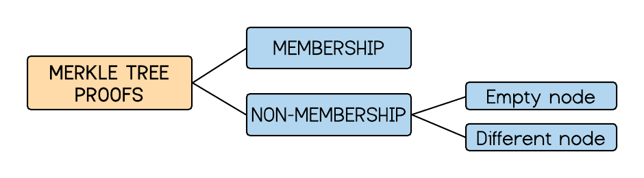
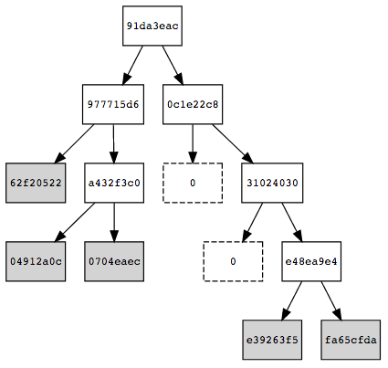
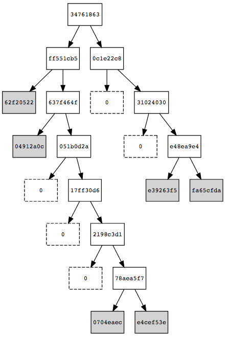

===========
Merkle Tree
===========

.. contents::    :depth: 3

.. raw:: latex

   \maketitle 

.. raw:: latex

   \vspace{1cm}

.. raw:: latex

   \tableofcontents

.. raw:: latex

   \vspace{0.5cm}

.. raw:: latex

   \newpage

Scope
=====

A Merkle tree or hash tree is an authenticated data structure where
every leaf node of the tree contains the cryptographic hash of a data
block and every non leaf node contains the concatenated hashes of its
child nodes (Haider 2018). If the majority of the leaves are empty, then
they are called sparse Merkle trees (Dahlberg, Pulls, and Peeters 2016).
This proposal aims to standardize the generation of this second kind of
binary trees.

Motivation
==========

Merkle trees allow to link a set of data to a unique hash value, which is
very optimal and useful, specially in blockchain technology, as it
provides a secure and efficient verification of large data sets by
storing only a little piece of data on-chain. For instance, they can be
used to verify any kind of data stored, handled and transferred in and
between computers. They can help ensure that data blocks received from
other peers in a peer-to-peer network are received undamaged and
unaltered, and even to check that the other peers do not lie and send
fake blocks (Wikipedians, n.d.).

Background
==========

We are still working on the literature compending the state of the art
of this area.

Terminology
===========

The following concepts are definitions and properties we assume across
the document.

-  The leaves of the Merkle tree consist of key-value pairs
   :math:`(k,v)`. We distinguish three different nodes:

   -  Empty node: A vertex that stores the key and value zero.

   -  Leaf: A vertex with both empty children.

   -  Internal node: A vertex with at least one non-empty child. The
      value is and the key such. It has the hash of its children.

-  A Merkle audit path for a leaf in a Merkle tree is the shortest list
   of additional nodes in the tree required to compute the root hash for
   that tree.

-  If the root computed from the audit path matches the true root, then
   the audit path is a proof of membership for that leaf in the tree.

-  Otherwise, it is a proof of non-membership for that leaf in the tree.

.. raw:: latex

   \centering

|image|

Challenges
==========

Work in progress.

Description
===========

| Let :math:`e=(k,v)` be a new entry in a tree :math:`T`. The node in
  which this piece of data :math:`e` is stored in :math:`T` is uniquely
  determined from the data itself. Let :math:`H` be a secure hash
  function returning an array of bits. [1]_ The leaf in which :math:`e`
  should be stored in :math:`T` is defined by

  .. math:: H_{path} = H(e) = H(1 || k || v).

   This array of bits is going to represent a path through the tree:
  starting by the less significant bit and from the root of :math:`T`,
  it descents the tree by taking the left edge if there is a 0 and right
  one if there is a 1.
| When adding an entry :math:`e`, we may not (see Sec.
  `7 <#sec-security>`__) go down to the last level of the tree (by last
  we mean looking at all the bits, length of which depends on the hash
  function :math:`H`). What we do instead, is go down through the path
  until we find a node without siblings (a leaf). If the leaf is empty,
  we store :math:`e`. Otherwise, that node stores some other :math:`e'`
  (as non-empty leafs store claims) with :math:`H(e') = H'_{path}`. This
  means that :math:`H_{path}` and :math:`H'_{path}` start with the same
  sequence of bits. We compare both hashes and go down the tree until
  the first different bit. these two values and find the first different
  bit (included). Then we store :math:`e` and :math:`e'` in their
  corresponding leafs of the path.
| As an example, consider :math:`e` such that
  :math:`H_{path}=0111111...` and the Merkle tree below where in each
  leaf there is represented the value (and not the key) of each stored
  piece of data:

.. raw:: latex

   \centering

|image|

If we go down the tree following the sequence 01111111... we get to the
leaf containing the value 0704eaec of some :math:`e'` with
:math:`H'_{path}=0111110...` . Comparing :math:`H_{path}` and
:math:`H'_{path}`, the 7th bit is the first different bit. This means,
that we should go down to the 7th level and store there the entries as
shown in next figure:

.. raw:: latex

   \centering

|image|

| Note that :math:`e` is stored in the right (as the 7th bit is a 1) and
  :math:`e'` is stored in the left (as it is a 0). Also note that the
  rest of siblings are empty nodes and how the root and intermediate
  nodes have changed.
| Each node is of the form :math:`(H[b, k, v])`, where :math:`b = 1` if
  terminal node (leaf) and :math:`b = 0` otherwise. More precisely,

-  Each leaf consists of a pair (:math:`H(1 || k || v)`, :math:`k||v`).

-  Each intermediate node of a pair (:math:`H(H_L||H_R)`,
   :math:`K_L||K_R`), where :math:`(H_L,K_L)` is the key-value of its
   left child and :math:`(H_L,K_L)` the key-value of its right child.

| 
| The procedure to store an entry in a Merkle tree is described below in
  pseudocode.

.. raw:: latex

   \setstretch{1.2}

.. raw:: latex

   \Procedure{Insert Entry $e$ in Merkle Tree $T$ with Root $r$}{}

:math:`H_{path} \gets \text{GetPath($e$)}`
:math:`b \gets \text{LeastSignificantBit($H_{Index}$)}`
:math:`r \gets e` :math:`r \gets e`
:math:`H_{Index} \gets H_{Index}\backslash{b}`
:math:`b \gets \text{LeastSignificantBit($H_{Index}$)}`
:math:`e' \gets \text{GetEntryStoredIn($r$)}`
:math:`H'_{path} \gets \text{GetPath($e'$)}` Find first bit :math:`b_j`
such that :math:`H_{path}(j) \not= H'_{path}(j)`
Leaf(\ :math:`b_0...b_j`)\ :math:`\gets e`
Leaf(\ :math:`b_0...b'_j`)\ :math:`\gets e'`
RecalculateIntermediateNodeValues(\ :math:`T`)

.. raw:: latex

   \newpage
   {\it We are working on 4 more procedures}

| : On one side, DELETE of entries and UPDATE of the tree. On the other
  side, the generation of MEMBERSHIP proofs and generation of
  NON-MEMBERSHIP proofs.
| These last two procedure, although we are working on explaining them
  in detail in the following delivery, they have already been
  implemented in GoLang and JavaScript in the following two
  repositories:

-  https://github.com/iden3/go-iden3/blob/master/merkletree/

-  https://github.com/iden3/iden3js/tree/master/src/sparse-merkle-tree

.. _sec-security:

Security
========

The security of an audit path reduces to the collision resistance of the
underlying hash function. For a proof, see (Dahlberg, Pulls, and Peeters
2016 Lemma 1).

Implementation
==============

The standarisation of Merkle trees we proposed are described an
implemented in GoLang and JavaScript by the iden3 team in the following
repositories:

-  https://github.com/iden3/go-iden3

-  https://github.com/iden3/iden3js

Some detailed examples are also provided in these repositories:

-  https://github.com/iden3/go-iden3/blob/master/merkletreeDoc/merkletree.md

-  https://github.com/iden3/iden3js/tree/master/examples

Intellectual Property
=====================

We will release the final version of this proposal under creative
commons, to ensure it is freely available to everyone.

.. raw:: latex

   \addcontentsline{toc}{section}{References}

.. raw:: latex

   \bibliographystyle{acm}

.. raw:: html

   

.. raw:: html

   

Dahlberg, Rasmus, Tobias Pulls, and Roel Peeters. 2016. “Efficient
Sparse Merkle Trees: Caching Strategies and Secure (Non-)Membership
Proofs.” Cryptology ePrint Archive, Report 2016/683.

.. raw:: html

   

.. raw:: html

   

Haider, Faraz. 2018. “Compact Sparse Merkle Trees.” Cryptology ePrint
Archive, Report 2018/955.

.. raw:: html

   

.. raw:: html

   

Wikipedians, B. n.d. *Data Structures*. PediaPress.
https://books.google.es/books?id=aYxSZurAGXEC.

.. raw:: html

   

.. raw:: html

   

.. [1]
   If the hash function :math:`H` does not return a binary number,
   binarize it later.

PDF Link
========

:download:`Merkle Tree <./MerkleTree.pdf>`
