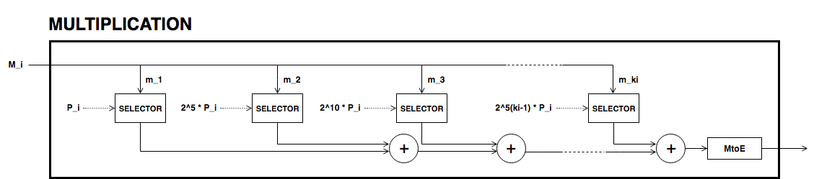

=============
Pedersen Hash
=============

.. contents::    :depth: 3

Scope
=====

The 4-bit window Pedersen hash function is a secure hash function which
maps a sequence of bits to a compressed point on an elliptic curve
(Libert, Mouhartem, and Stehlé 1016–17AD).

This proposal aims to standardize this hash function for use primarily
within the arithmetic circuits of zero knowledge proofs, together with
other generic uses such as for Merkle tree or any use cases requiring a
secure hash function.

As part of the standard, the paper details the elliptic curve used for
the hash function, the process to compute the Pedersen hash from a given
sequence of bits, and the computation of the hash from a sequences of
bits using an arithmetic circuit—which can be used within zero knowledge
proofs.

Moreover the paper includes references to open-source implementations of
the Pedersen hash function which follows the computation process details
in this proposal.

Motivation
==========

The primary advantage of this Pedersen hash function is its efficiency.
The ability to compute the hash efficiently makes it an attractive
proposal for use within the circuits associated with zk-SNARK proofs
(“ZCash Open Discussion: Choose Improved Hash Function for Merkle Tree
(or Replace Merkle Tree)” Accessed February 25, 2018). Having a
standard, secure, and efficient hash function is one of the paramount
aspect for implementing usable, comprehensible, and easily verifiable
zero knowledge proofs.

Background
==========

The Pedersen hash has already been defined and used by the ZCash team in
Sapling, their latest network upgrade (Hopwood et al. 2018). They
construct it on the Jubjub elliptic curve and using 3-bit lookup tables.
In this document, we propose a different implementation of the Pedersen
hash function using Baby-Jubjub elliptic curve and 4-bit windows, which
requires less constraints per bit than using 3-bit windows.

Terminology
===========

Elliptic Curve: Baby-Jubjub
---------------------------

Consider the prime number

.. math::

   p = 21888242871839275222246405745257275088548364
   400416034343698204186575808495617

 and let :math:`{\ensuremath{\mathbb{F}_p}}` be the finite field with
:math:`p` elements.

We define :math:`E_M` as the *Baby-Jubjub* Montgomery elliptic curve
defined over :math:`{\ensuremath{\mathbb{F}_p}}` given by equation

.. math:: E: v^2 = u^3 +  168698u^2 + u.

 The order of :math:`E_M` is :math:`n = 8\times r`, where

.. math::

   r = 2736030358979909402780800718157159386076813972
   158567259200215660948447373041

 is a prime number. Denote by :math:`{\ensuremath{\mathbb{G}}}` the
subgroup of points of order :math:`r`, that is,

.. math:: {\ensuremath{\mathbb{G}}}= \Set{ P \in E({\ensuremath{\mathbb{F}_p}}) | r P = O  }.

| :math:`E_M` is birationally equivalent to the Edwards elliptic curve

  .. math:: E: x^2 + y^2 = 1 +  d x^2 y^2

   where
  :math:` d = 9706598848417545097372247223557719406784115219466060233080913168975159366771.`
| The birational equivalence (Bernstein et al. 2008 Thm. 3.2) from
  :math:`E` to :math:`E_M` is the map

  .. math:: (x,y) \to (u,v) = \left( \frac{1 + y}{1 - y} , \frac{1 + y}{(1 - y)x} \right)

   with inverse from :math:`E_M` to :math:`E`

  .. math:: (u, v) \to (x, y) = \left(  \frac{u}{v}, \frac{u - 1}{u + 1}   \right).

Pedersen Hash
-------------

Let :math:`M` be a sequence of bits. The *Pedersen hash* function of
:math:`M` is defined as follows:

-  Let :math:`P_0,P_1,\dots,P_k` be uniformly sampled generators of
   :math:`{\ensuremath{\mathbb{G}}}` (for some specified integer
   :math:`k`).

-  Split :math:`M` into sequences of at most 200 bits and each of those
   into chunks of 4 bits [1]_. More precisely, write

   .. math::

      \begin{gathered}
      		M = M_0M_1\dots M_l 
      		\quad\text{where}\quad
      		M_i = m_0m_1\dots m_{k_i}
      		\quad\text{with}\quad 
      		\begin{cases}
      			k_i = 49 	\;\text{ for }  i = 0, \dots, l-1, \\
      			k_i \leq 49 \;\text{ for }  i = l,
      		\end{cases}
      	\end{gathered}

    where the :math:`m_j` terms are chunks of 4 bits
   :math:`[b_0\: b_1\: b_2\: b_3]`. Define

   .. math::

      enc(m_j) = (2b_3-1) 
      		\cdot (1+b_{0}+2b_{1}+4b_{2})

    and let

   .. math:: \langle M_i \rangle = \sum_{j=0}^{k_i-1} enc(m_j) \cdot 2^{5j}.

    We define the Pedersen hash of :math:`M` as

   .. math::

      \label{eq-ped}
      		H(M) = \langle M_0 \rangle \cdot P_0 
      		+  \langle M_1 \rangle \cdot P_1 
      		+  \langle M_2 \rangle \cdot P_2 
      		+ \dots + \langle M_l \rangle \cdot P_l.

    Note that the expression above is a linear combination of elements
   of :math:`{\ensuremath{\mathbb{G}}}`, so itself is also an element of
   :math:`{\ensuremath{\mathbb{G}}}`. That is, the resulting Pedersen
   hash :math:`H(M)` is a point of the elliptic curve :math:`E` of order
   :math:`r`.

Description
===========

Set Of Generators
-----------------

We generate the points :math:`P_0,\dots,P_{{k}}` in such a manner that
it is difficult to find a connection between any of these two points.
More precisely, we take ``D = string\_seed`` followed by a byte ``S``
holding that smallest number that ``H = Keccak256(D || S)`` results in a
point in the elliptic curve :math:`E`.

Computation Of The Pedersen Hash
--------------------------------

In the following circuit pedersen hash, we have depicted the circuit
used to compute the Pedersen hash of a message :math:`M` described in
equation [eq-ped]. Each multiplication box returns a term of the sum.

|image| |image|

As the set of generators are fixed, we can precompute its multiples and
use 4-bit lookup windows to select the right points. This is done as
shown in the circuit called selector. This circuit receives 4-bit chunk
input and returns a point. The first three bits are used to select the
right multiple of the point and last bit decides the sign of the point.
The sign determines if the :math:`x`-coordinate should be taken positive
or negative, as with Edwards curves, negating a point corresponds to the
negation of its first coordinate.

|image|

[sec-computation]

Examples And Test Vectors
-------------------------

*Work In Progress*

Challenges
==========

One of the main challenges to create this standard and to see it adopted
by the community is to provide correct, usable, and well-maintained
implementations in as many languages as possible.

Some effort is also required to audit and verify code coming from the
community and claiming to implement the 4-bit window Pedersen hash
function to prevent the propagation of potentially insecure
implementations.

Finally, the proposal as it stands today includes the padding of the
message :math:`M` to a multiple of four bits. There are potentials
issues with this approach where collisions can happen.

Security
========

Overflow Prevention
-------------------

| As we described in section [sec-computation], we use a windowed scalar
  multiplication algorithm with signed digits. Each 4-bit message chunk
  corresponds to a window called selector and each chunk is encoded as
  an integer from the set :math:`\{-8..8\}\backslash \{0\}`. This allows
  a more efficient lookup of the window entry for each chunk than if the
  set :math:`\{1..16\}` had been used, because a point can be
  conditionally negated using only a single constraint (Hopwood et al.
  2018).
| As there are up to 50 segments per each generator :math:`P_i`, the
  largest multiple of the generator :math:`P_i` is :math:`n\cdot P_i`
  with

  .. math:: n = 2^0 \times8 + 2^5 \times 8 + \left(2^5\right)^2 \times8 \dots + 	2^{245}\times 8 .

   To avoid overflow, this number should be smaller than
  :math:`(r-1)/2`. Indeed,

  .. math::

     \begin{aligned}
     	\quad\; n 
     	& = 8 \times \sum_{ k = 0}^{49} 2^{5k}
     	= 8 \times \frac{2^{250}-1}{2^5-1}\\
     	& = 466903585634339497675689455680193176827701551071131306610716064548036813064

   and

  .. math::

     \begin{aligned}
     	\frac{r-1}{2} &= 1368015179489954701390400359078579693038406986079283629600107830474223686520 \\
     	& > n.\\ \vspace{0.4cm}\end{aligned}

Implementation
==============

A Note On Efficency: Number Of Constraints Per Bit
--------------------------------------------------

| When using 3-bit and 4-bit windows, we have **1 constraint for the
  sign** and **3 for the sum** (as we are using the Montgomery form of
  the curve, that requires only 3). Now let’s look at the constraints
  required for the multiplexers.
| With 3-bit windows we need only one constraint per multiplexer, so **2
  constraints** in total.
| Standard 4-bit windows require two constraints: one for the output and
  another to compute :math:`s_0*s_1`. So, a priori we would need 4
  constraints, two per multiplexer. But we can reduce it to 3 as the
  computation of :math:`s_0*s_1` is the same in both multiplexers, so
  this constraint can be reused. This way only **3 constraints** are
  required.
| So, the amount of constraints per bit are:

-  3-lookup window : :math:` (1+3+2)/3 = 2 ` constraints per bit.

-  4-lookup window : :math:` (1 +3+3)/4 = 1.75 ` constraints per bit.

The specific constraints can be determined as follows: let the
multiplexers of coordinates :math:`x` and :math:`y` be represented by
the following look up tables:

+---------------+---------------+---------------+---------------+
| :math:`s_2`   | :math:`s_1`   | :math:`s_0`   | :math:`out`   |
+===============+===============+===============+===============+
| 0             | 0             | 0             | :math:`a_0`   |
+---------------+---------------+---------------+---------------+
| 0             | 0             | 1             | :math:`a_1`   |
+---------------+---------------+---------------+---------------+
| 0             | 1             | 0             | :math:`a_2`   |
+---------------+---------------+---------------+---------------+
| 0             | 1             | 1             | :math:`a_3`   |
+---------------+---------------+---------------+---------------+
| 1             | 0             | 0             | :math:`a_4`   |
+---------------+---------------+---------------+---------------+
| 1             | 0             | 1             | :math:`a_5`   |
+---------------+---------------+---------------+---------------+
| 1             | 1             | 0             | :math:`a_6`   |
+---------------+---------------+---------------+---------------+
| 1             | 1             | 1             | :math:`a_7`   |
+---------------+---------------+---------------+---------------+

+---------------+---------------+---------------+---------------+
| :math:`s_2`   | :math:`s_1`   | :math:`s_0`   | :math:`out`   |
+===============+===============+===============+===============+
| 0             | 0             | 0             | :math:`b_0`   |
+---------------+---------------+---------------+---------------+
| 0             | 0             | 1             | :math:`b_1`   |
+---------------+---------------+---------------+---------------+
| 0             | 1             | 0             | :math:`b_2`   |
+---------------+---------------+---------------+---------------+
| 0             | 1             | 1             | :math:`b_3`   |
+---------------+---------------+---------------+---------------+
| 1             | 0             | 0             | :math:`b_4`   |
+---------------+---------------+---------------+---------------+
| 1             | 0             | 1             | :math:`b_5`   |
+---------------+---------------+---------------+---------------+
| 1             | 1             | 0             | :math:`b_6`   |
+---------------+---------------+---------------+---------------+
| 1             | 1             | 1             | :math:`b_7`   |
+---------------+---------------+---------------+---------------+

We can express them with the following 3 constraints:

-  :math:`aux = s_0 s_1`

-  | :math:`out = [ (a_7-a_6-a_5+a_4-a_3+a_2+a_1-a_0)*aux 
         		+ (a_6-a_4-a_2+a_0)*s_1`
   | :math:`\text{\qquad\;\;} + (a_5-a_4-a_1+a_0)*s_0
         		+ (a_4 - a_0) ] z 
         		+ (a_3-a_2-a_1+a_0)*aux + (a_2-a_0)*s_1 `
   | :math:`\text{\qquad\;\;} + (a_1-a_0)*s_0+ a_0`

-  | :math:` out = [ (b_7-b_6-b_5+b_4-b_3+b_2+b_1-b_0)*aux 
         		+ (b_6-b_4-b_2+b_0)*s_1`
   | :math:`\text{\qquad\;\;} + (b_5-b_4-b_1+b_0)*s_0 
         		+ (b_4 - b_0)] z 
         		+ (b_3-b_2-b_1+b_0)*aux + (b_2-b_0)*s_1 \\
         		\text{\qquad\;\:} + (b_1-b_0)*s_0+ b_0`

Existing Implementations
------------------------

Implementation of the specifications and arithmetic of the Baby-Jubjub
curve:

-  Barry WhiteHat (SAGE): https://github.com/barryWhiteHat/baby_jubjub.

-  Jordi Baylina (circom language):
   https://github.com/iden3/circomlib/blob/master/circuits/babyjub.circom.

Implementation of the Pedersen Hash function:

-  Jordi Baylina (circom language):
   https://github.com/iden3/circomlib/blob/master/circuits/.

Intellectual Property
=====================

The source code of the implementations listed in this proposal are
publicly available. Circom is licensed under GPL3.

.. raw:: html

   

.. raw:: html

   

Bernstein, Daniel J., Peter Birkner, Marc Joye, Tanja Lange, and
Christiane Peters. 2008. “Twisted Edwards Curves.” Cryptology ePrint
Archive, Report 2008/013.

.. raw:: html

   

.. raw:: html

   

Hopwood, Daira, Sean Bowe, Taylor Hornby, and Nathan Wilcox. 2018.
“ZCash Protocol Specification Version 2018.0-Beta-31.”

.. raw:: html

   

.. raw:: html

   

Libert, B., F. Mouhartem, and D. Stehlé. 1016–17AD. “Tutorial 8.”

.. raw:: html

   

.. raw:: html

   

“ZCash Open Discussion: Choose Improved Hash Function for Merkle Tree
(or Replace Merkle Tree).” Accessed February 25, 2018.

.. raw:: html

   

.. raw:: html

   

.. [1]
   If :math:`M` is not a multiple of 4, pad :math:`M` to a multiple of 4
   bits by appending zero bits.

.. |image| image:: figures/pedersen-hash.png

.. |image| image:: figures/pedersen-multiplication-selector.png

PDF Link
========

:download:`Pedersen Hash <./Pedersen-Hash.pdf>`